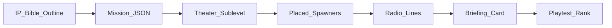

# SkyWarrior — Campaign Content Pipeline (Phase 4)

Workflow for producing 8-mission indie campaign without exploding scope.

---

## Mission authoring flow

1. **Outline** — mission title, type, objectives in `docs/IP_BIBLE.md`
2. **JSON** — `Content/Missions/M##_*.json` (mod-friendly schema)
3. **Sublevel** — World Partition slice or sublevel for spawns/triggers
4. **Spawns** — `AEnemyFighter`, `ASAMSite`, `ACampaignAceActor` placed or spawned from JSON
5. **Radio** — lines in JSON `radio[]` → `URadioSubsystem::QueueRadioLine`
6. **Briefing** — 2D map card (UMG) reading JSON briefing text
7. **QA** — rank target S/A on golden path; update tuning

---

## JSON schema (version 1)

Required fields:

- `missionId`, `title`, `briefing`, `timeLimitSeconds`
- `objectives[]`: `id`, `type` (`destroyAir` | `destroyGround` | …), `description`, `count`

Optional:

- `spawns[]`, `radio[]`, `loadout`, `theater`, `checkpoints[]`

Parser: `UMissionSubsystem::LoadMissionFromJson`

---

## Ace mission template

| Element | Implementation |
|---------|----------------|
| Unique paint | Material instance on ace blueprint |
| Phase 2 behavior | `ACampaignAceActor::AdvancePhase()` |
| Radio intro | High-priority `FRadioLine` |
| Rank bonus | Extra score for ace kill |

Aces defined in `docs/IP_BIBLE.md`: Crimson Wraith, Iron Sparrow, Ghost Ledger, Harbor King.

---

## Cutscene pipeline (deferred)

1. Block out in Sequencer (in-engine)
2. Export subtitle CSV from radio script
3. VO record → MetaSounds cue
4. Hook mission start/end via `UMissionSubsystem` delegates

---

## Content milestones

| Milestone | Missions | Notes |
|-----------|----------|-------|
| Vertical slice | M01 | Phase 1 |
| Mission OS demo | M01–M03 | Phase 2 |
| Hangar alpha | M01–M05 | Phase 3 |
| Campaign alpha | M01–M08 | Phase 4 |
| Polish pass | All | Phase 5 |

---

## Localization hook

All player-facing strings in JSON and `FText` keys — no hardcoded C++ mission copy.
